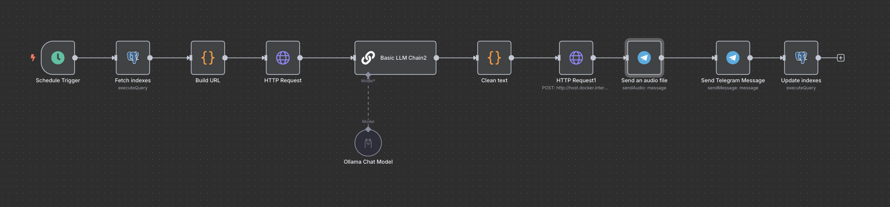
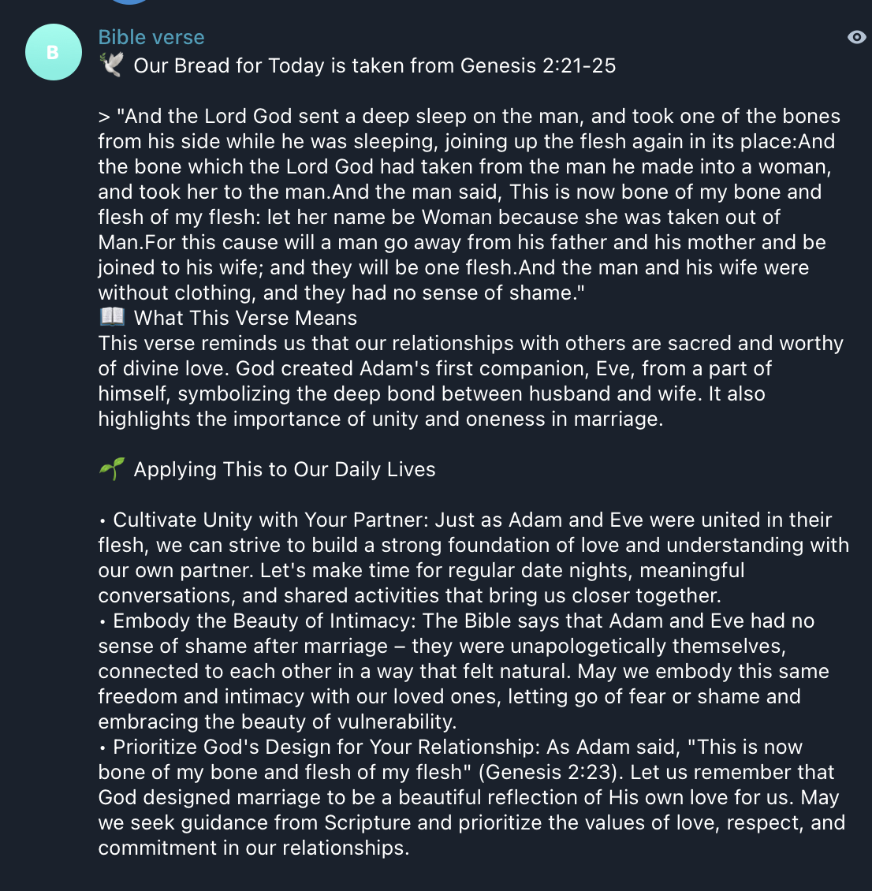

# Bible Daily Automation

An automated pipeline that fetches a daily Bible passage, generates an explanation using a local LLM, converts it to speech, and sends both the audio and text to a Telegram channel — every day, automatically.

## How it works

```
Schedule Trigger
     │
     ▼
Fetch current index (PostgreSQL)
     │
     ▼
Build Bible API URL
     │
     ▼
HTTP Request (fetch Bible passage)
     │
     ▼
Ollama LLM (explain the verse)
     │
     ▼
Clean Text
     │
     ▼
HTTP Request → pocket-tts (TTS server)
     │
     ├──▶ Send Audio (Telegram)
     │         │
     │         ▼
     │    Send Text Message (Telegram)
     │
     ▼
Update index (PostgreSQL)
```

##  Stack

| Component | Technology |
|---|---|
| Workflow Automation | [n8n](https://n8n.io) |
| LLM | [Ollama](https://ollama.com) (local) |
| Text-to-Speech | [pocket-tts](https://huggingface.co/kyutai/pocket-tts) (alba voice) |
| Database | PostgreSQL |
| Delivery | Telegram Bot |

##  Project Structure

```
.
├── render.yaml               # Render blueprint (optional deployment)
├── README.md
├── postgres/
│   └── schema.sql            # Database schema and seed data
├── pocket-tts/
│   ├── Dockerfile
│   └── app.py                # Flask TTS server
└── n8n/
    ├── Dockerfile
    └── workflow.json         # Exported n8n workflow
```

## Local Setup

### Prerequisites
- Docker
- Ollama installed and running locally
- PostgreSQL running locally or on Neon.tech
- A Telegram bot token and channel

### 1. Clone the repo

```bash
git clone https://github.com/yourname/bible-automation.git
cd bible-automation
```

### 2. Initialize the database

```bash
psql -U youruser -d yourdb -f postgres/schema.sql
```

### 3. Pull your Ollama model

```bash
ollama pull llama3.2
ollama serve
```

### 4. Start pocket-tts

```bash
cd pocket-tts
docker build -t pocket-tts .
docker run -d --name pocket-tts -p 8000:8000 pocket-tts
```

### 5. Start n8n

```bash
docker run -d \
  --name n8n \
  -p 5678:5678 \
  -e DB_TYPE=postgresdb \
  -e DB_POSTGRESDB_HOST=localhost \
  -e DB_POSTGRESDB_PORT=5432 \
  -e DB_POSTGRESDB_DATABASE=n8n \
  -e DB_POSTGRESDB_USER=n8n \
  -e DB_POSTGRESDB_PASSWORD=yourpassword \
  docker.n8n.io/n8nio/n8n
```

### 6. Import the workflow

In n8n UI: **Add Workflow → Import from file → `n8n/workflow.json`**

Then re-enter your credentials:
- Telegram bot token
- PostgreSQL connection
- Ollama base URL (default: `http://host.docker.internal:11434`)

### 7. Activate

Toggle the workflow **on** in n8n — it will run on its configured schedule.

## Screenshots

### n8n Workflow


### Telegram Output

